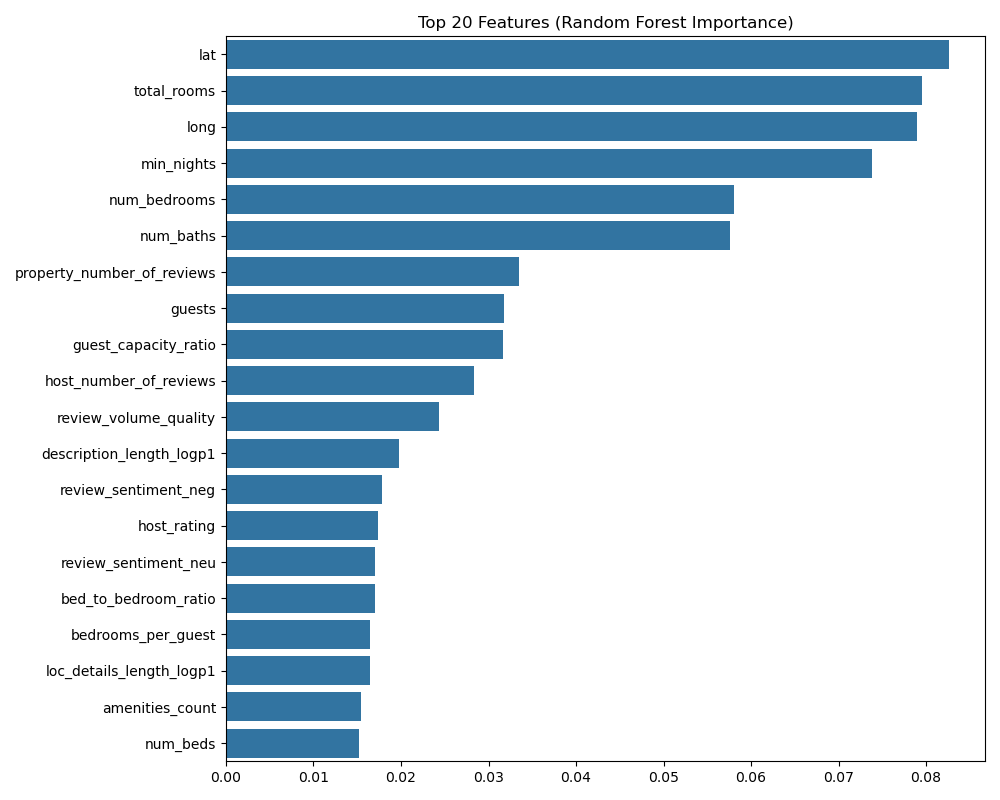
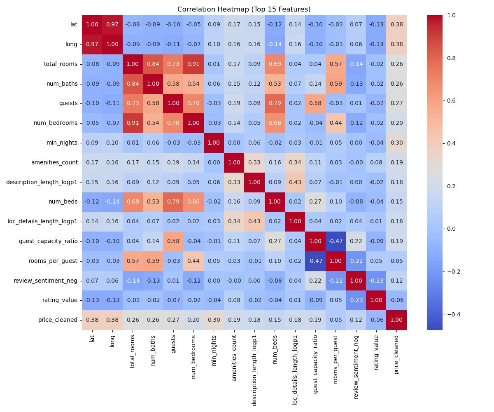

# Feature Analysis Report

## 1. Top Correlations with Price (Log)
| Feature | Correlation |
|---|---|
| lat | 0.3973 |
| long | 0.3939 |
| total_rooms | 0.2940 |
| num_baths | 0.2911 |
| guests | 0.2628 |
| num_bedrooms | 0.2433 |
| min_nights | 0.2390 |
| amenities_count | 0.1983 |
| description_length_logp1 | 0.1833 |
| num_beds | 0.1568 |
| loc_details_length_logp1 | 0.1421 |
| guest_capacity_ratio | 0.1158 |
| rooms_per_guest | 0.1003 |
| review_sentiment_neg | 0.0917 |
| rating_value | -0.0858 |
| review_sentiment_pos | -0.0716 |
| rating_location | 0.0680 |
| host_number_of_reviews | 0.0638 |
| host_year | 0.0544 |
| review_sentiment_neu | 0.0517 |
| rating_check_in | -0.0497 |
| rating_communication | -0.0433 |
| beds_per_guest | -0.0431 |
| property_number_of_reviews | -0.0393 |
| review_volume_quality | -0.0208 |
| rating_accuracy | -0.0189 |
| rating_cleanliness | -0.0174 |
| host_rating | 0.0132 |
| superhost_rating_interaction | -0.0109 |
| bed_to_bedroom_ratio | -0.0086 |
| ratings | 0.0041 |
| bedrooms_per_guest | -0.0000 |

## 2. Linear Regression Coefficients
Using ElasticNet (L1+L2) to highlight important features.

| Feature | Coefficient |
|---|---|
| lat | 0.0041 |
| long | 0.0060 |
| guests | 0.0737 |
| num_baths | 0.1693 |
| rating_location | 0.2897 |
| rating_value | -0.0351 |
| beds_per_guest | -0.0833 |
| total_rooms | 0.0574 |
| amenities_count | 0.0022 |
| review_sentiment_pos | -0.0479 |
| review_sentiment_neg | 1.8679 |
| min_nights | 0.0210 |
| description_length_logp1 | 0.0227 |
| loc_details_length_logp1 | 0.0034 |
| type_Home | -0.1866 |
| type_Other | 0.1354 |

*Note: Remaining coefficients belong to OneHotEncoded features (City, etc.) starting at index 40*

## 3. Random Forest Feature Importance
| Feature | Importance |
|---|---|
| lat | 0.0826 |
| total_rooms | 0.0795 |
| long | 0.0790 |
| min_nights | 0.0738 |
| num_bedrooms | 0.0580 |
| num_baths | 0.0576 |
| property_number_of_reviews | 0.0335 |
| guests | 0.0317 |
| guest_capacity_ratio | 0.0317 |
| host_number_of_reviews | 0.0284 |
| review_volume_quality | 0.0244 |
| description_length_logp1 | 0.0197 |
| review_sentiment_neg | 0.0179 |
| host_rating | 0.0174 |
| review_sentiment_neu | 0.0171 |
| bed_to_bedroom_ratio | 0.0170 |
| bedrooms_per_guest | 0.0165 |
| loc_details_length_logp1 | 0.0164 |
| amenities_count | 0.0154 |
| num_beds | 0.0152 |
| host_year | 0.0149 |
| rooms_per_guest | 0.0142 |
| beds_per_guest | 0.0138 |
| type_Other | 0.0131 |
| ratings | 0.0126 |
| review_sentiment_pos | 0.0123 |
| rating_location | 0.0088 |
| type_Home | 0.0056 |
| superhost_rating_interaction | 0.0053 |
| rating_value | 0.0046 |
| rating_cleanliness | 0.0037 |
| rating_accuracy | 0.0032 |
| rating_check_in | 0.0026 |
| type_Rental_unit | 0.0024 |
| rating_communication | 0.0024 |
| is_superhost_binary | 0.0020 |
| review_sentiment_missing | 0.0008 |
| type_Condo | 0.0008 |
| type_Serviced_apartment | 0.0004 |
| type_Loft | 0.0001 |

## 4. Observations
- **Correlations:** High correlation indicates a strong linear relationship.
- **RF Importance:** Captures non-linear relationships and interactions.
- **LR Coefficients:** Shows direction and magnitude of effect after regularization.

## 5. Visualizations

